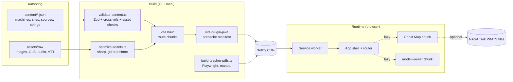
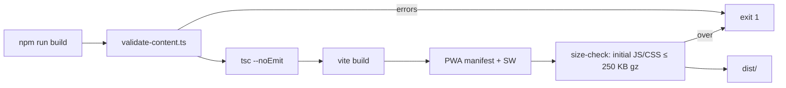
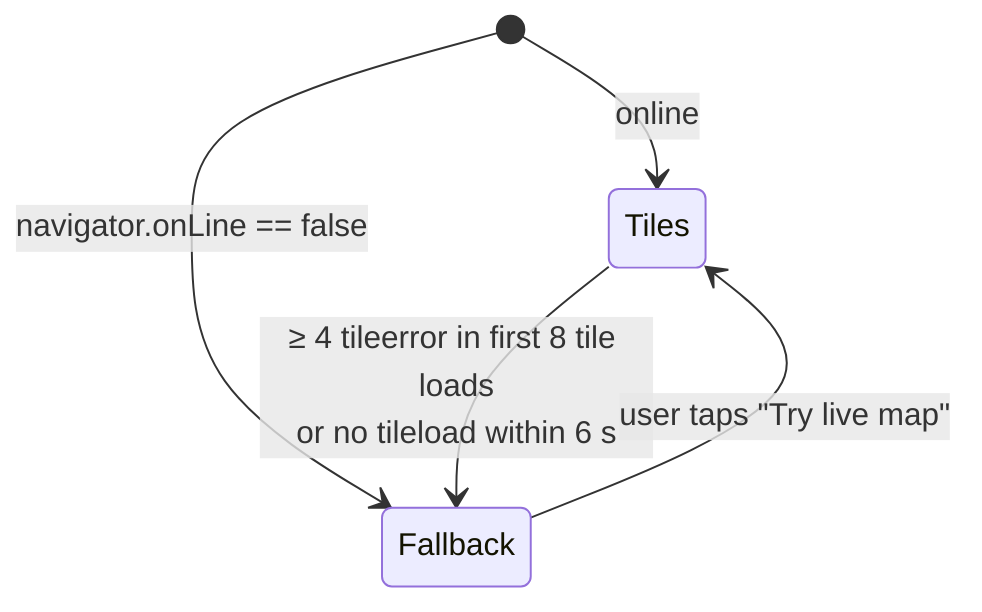
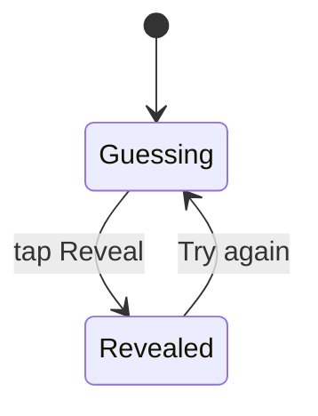
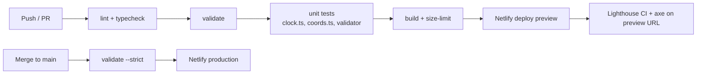

# STILL HERE: System Design

**Version:** 1.0 (pre-hackathon) · **Companion to:** SRS & Technical Specification v1.0
**Audience:** the build team. Read this before hour 0; it is the "how", the spec is the "what".

This document turns the spec into concrete designs: the decisions we have locked, the data model, the build pipeline, the runtime architecture, each subsystem, caching and offline behavior, security headers, failure handling, and CI. Where it changes the spec, it says so (marked **Δ spec**).

---

## 1. Design drivers

The architecture is shaped by six constraints. Every decision below traces back to one of them.

| # | Driver | Consequence |
| - | ------ | ----------- |
| D1 | 48-hour build, 3–5 people | Boring, well-documented tools. No backend. Content authored in parallel with code. |
| D2 | Audience is minors (8–16) | No accounts, cookies, analytics, or third-party requests at runtime (except NASA tiles). |
| D3 | Accuracy is judged | Facts are data with mandatory sources; the build refuses to ship unsourced or unverified facts. |
| D4 | Demo must not fail | Every network dependency has a local fallback; the whole demo path works in airplane mode. |
| D5 | Phones and school laptops | Small initial bundle; heavy features (map, 3D, audio) load on demand. |
| D6 | New machines without code | Content discovered by file globbing; the UI renders whatever the schema allows. |

---

## 2. Decision log (locked)

These are closed. Reopen one only if it blocks the build.

| Area | Decision | Rejected | Why |
| ---- | -------- | -------- | --- |
| Framework | React 18 + TypeScript + Vite | Next.js, Astro | Pure SPA, fastest setup, no SSR needed. |
| Routing | React Router v6 (`createBrowserRouter`, lazy routes) | File-based routes | Built-in code splitting per route via `lazy`. |
| Styling | Tailwind CSS + CSS custom-property tokens | CSS Modules | Speed; tokens keep theming in one file. |
| Validation | Zod, shared by app and build script | JSON Schema | One schema source, TypeScript types inferred from it. |
| Map | Leaflet 1.9 + react-leaflet, `L.CRS.EPSG4326` | OpenLayers, Cesium | Small, mobile-friendly, matches Trek's equirectangular tiling. |
| 3D | `@google/model-viewer`, **Meshopt** geometry + **WebP** textures | Draco, KTX2 | One compression path, one small self-hosted decoder. |
| Offline | `vite-plugin-pwa` (`generateSW`, `registerType: 'autoUpdate'`) | Hand-written SW | Workbox handles precache manifests and versioning. |
| Hosting | **Netlify** **(Δ spec)** | GitHub Pages, Vercel | Response headers (CSP) and SPA rewrite in one `netlify.toml`; per-branch previews. GitHub Pages cannot set headers. |
| Fonts | Self-hosted WOFF2 in `public/fonts/` **(Δ spec)** | Google Fonts | No third-party request; works offline. |
| Teacher PDFs | Print-styled HTML route rendered to PDF by Playwright script, committed to `public/teacher/` | Runtime PDF generation, hand-made PDFs | Single source of content; no runtime cost (FR-TCH-3). |
| Node | Node 20 LTS, npm | pnpm, yarn | Fewest surprises on teammates' machines. |

---

## 3. Architecture overview



Three facts to hold in your head:

1. **There is no server.** Netlify serves static files. Everything dynamic (Voyager's distance, the Mission Clock reveal) is computed in the browser.
2. **Content is code-split, not fetched.** Machine JSON files are imported through `import.meta.glob`, so Vite turns each into its own chunk. No `fetch()` of content, no loading race, and the service worker precaches them with the app.
3. **The only runtime third party is NASA Trek tiles**, and the app works without them.

---

## 4. Repository layout

```
still-here/
├─ src/
│  ├─ main.tsx                 router, providers, SW registration
│  ├─ routes/                  Landing, MapPage, MachinePage, Finale, Sources, About, TeacherSheet (print)
│  ├─ components/
│  │  ├─ story/                BeatSection, Letter, FactBox, ProgressDots, StatusBadge, GlossaryTerm
│  │  ├─ clock/                MissionClock, LifetimeBars, GuessSlider, StatCard
│  │  ├─ map/                  GhostMap, WorldSwitcher, SiteMarker, SiteCard, MapListView, DeepSpaceDiagram, SiteCloseup
│  │  ├─ media/                ModelViewerPanel, AudioPlayer, CreditedImage
│  │  └─ layout/               Header, Footer (build id), SkipLink, ReadingToggle
│  ├─ content/
│  │  ├─ en/machines/*.json    one file per machine (text + data)
│  │  ├─ en/strings.json       UI strings
│  │  ├─ en/glossary.json      tap-to-define terms
│  │  ├─ sites.json            all coordinates (language-neutral)
│  │  ├─ sources.json          source registry + verification
│  │  └─ assets.json           asset register (license, credit, used-in)
│  ├─ lib/
│  │  ├─ schema.ts             Zod schemas (imported by app AND scripts)
│  │  ├─ content.ts            manifest + lazy machine loader
│  │  ├─ clock.ts              lifetime/ongoing value math
│  │  ├─ coords.ts             longitude normalization helpers
│  │  ├─ i18n.ts               t() + locale context
│  │  ├─ storage.ts            sessionStorage wrapper (try/catch)
│  │  └─ prefs.tsx             PrefsContext: readingMode, locale, reducedMotion, world
│  └─ styles/                  tokens.css, global.css, print.css
├─ public/
│  ├─ basemaps/                moon.webp, mars.webp (fallback equirectangular)
│  ├─ closeups/                pre-cropped LROC/HiRISE images
│  ├─ models/  images/  audio/  captions/  teacher/  fonts/
│  └─ decoders/meshopt/        self-hosted meshopt_decoder.js
├─ scripts/
│  ├─ validate-content.ts
│  ├─ optimize-assets.ts
│  ├─ build-teacher-pdfs.ts
│  └─ fact-register.ts         generates docs/FACT_REGISTER.md from JSON
├─ docs/                       SPEC.md, SYSTEM_DESIGN.md, FACT_REGISTER.md (generated), QA.md
├─ netlify.toml
└─ vite.config.ts
```

---

## 5. Content model

The content model is the heart of the system: get it right and the UI is mostly rendering. Four changes from spec §6.4, each fixing a real defect.

### 5.1 Sites own coordinates **(Δ spec)**

The spec gave each machine one `coords` field. That breaks twice: the LRV exists at three sites (Apollo 15, 16, 17), and Apollo 15 has both an LRV and a retroreflector, so two markers would overlap.

**Design:** coordinates live only in `sites.json`. Machines reference sites. The map draws one marker per *site*; a site card lists every featured machine there.

```jsonc
// src/content/sites.json
{
  "id": "apollo-15",
  "name": "Apollo 15 landing site (Hadley–Apennine)",
  "world": "moon",
  "lat": 0, "lon": 0,                       // placeholder; fill from source
  "sourceCoords": { "value": "...", "system": "as published" },
  "sourceId": "src-apollo15-site",
  "minor": false,                           // true = only shown with "humanity's footprint" toggle
  "mission": "Apollo 15", "year": 1971,
  "closeup": { "image": "closeups/apollo-15.webp", "hotspots": [ { "x": 0.42, "y": 0.61, "label": "...", "text": "..." } ] }
}
```

```jsonc
// in a machine file
"siteIds": ["apollo-15", "apollo-16", "apollo-17"],
"primarySiteId": "apollo-15"
```

### 5.2 One coordinate convention **(Δ spec)**

Mission sources mix west/east longitude and 0–360°/±180° ranges. One bad conversion puts a rover in the wrong crater.

- **Stored:** planetocentric latitude (−90…90), **east-positive** longitude (−180…180), decimal degrees.
- **Original:** the value exactly as the source published it goes in `sourceCoords`, so a reviewer can re-check the conversion.
- **Enforced:** Zod refines the ranges; `coords.ts` exports the only conversion helper (`toEastPm180(value, system)`), unit-tested with known sites.
- Deep-space objects have no site; they use `world: "deep-space"` and appear only in the diagram.

### 5.3 Mission Clock is a typed, possibly live value **(Δ spec)**

A fixed `actual` number works for Ingenuity, but not for Voyager (its age and distance change daily), and it hides the "until when?" choice for Spirit (last contact vs. official end date). It also gives the LRV and retroreflectors nothing to show.

```ts
// src/lib/schema.ts (excerpt)
const Lifetime = z.object({
  kind: z.literal("lifetime"),
  unit: z.enum(["sols", "flights", "days", "years"]),
  expected: z.number().positive(),
  actual: z.union([
    z.object({ type: z.literal("fixed"), value: z.number().positive() }),
    z.object({ type: z.literal("ongoing"), start: z.string().date() }), // computed: now − start
  ]),
  rule: z.literal("until-last-contact"),     // one rule for every machine, shown in the fact box
  sourceId: SourceId,
  sliderMax: z.number().positive(),
});

const Stat = z.object({                      // LRV, retroreflectors (FR-CLK-5, now a Must)
  kind: z.literal("stat"),
  label: z.string(),                         // "Distance driven"
  value: z.number(), unit: z.string(),
  guess: z.object({ min: z.number(), max: z.number() }).optional(),
  sourceId: SourceId,
});

const Live = z.object({                      // Voyager distance / light-time counter
  kind: z.literal("live"),
  quantity: z.literal("distance-from-earth"),
  valueAtEpoch: z.number(), unit: z.literal("km"),
  ratePerSecond: z.number(),                 // radial speed from source
  asOf: z.string().datetime(),
  sourceId: SourceId,
});

export const Clock = z.discriminatedUnion("kind", [Lifetime, Stat, Live]);
```

`clock.ts` computes everything; components never do arithmetic:

```ts
export function liveValue(c: LiveClock, now = Date.now()) {
  const dt = (now - Date.parse(c.asOf)) / 1000;
  return c.valueAtEpoch + c.ratePerSecond * dt;     // linear extrapolation, labeled "about"
}
export const lightTime = (km: number) => km / 299_792.458; // seconds
```

Live values are always shown with "about" and the `asOf` date, and the extrapolation method is stated in the fact box. Re-pull the source numbers the week of the event.

### 5.4 Status plus tags **(Δ spec)**

Keep the four statuses; they are the product's core message and the legend must stay simple. Add optional `tags` for nuance the single status cannot express, rendered as small secondary chips with text:

| Tag | Example use |
| --- | ----------- |
| `heritage` | Retroreflectors: `active` and also a historic site |
| `in-use` | Still used by scientists on Earth |
| `out-of-contact` | Contact ended, but the hardware may still be operating |

Every tag that makes a factual claim needs a fact with a source in the same machine file (validator checks this via `tagFactIds`).

### 5.5 Facts carry verification state

The fact register stops being a separate spreadsheet that drifts. It is generated from the content.

```jsonc
// src/content/sources.json
{
  "id": "src-ingenuity-flights",
  "title": "...", "publisher": "NASA/JPL", "url": "https://...",
  "retrieved": "2026-11-01", "license": "NASA media usage guidelines",
  "verified": { "by": "initials", "on": "2026-11-03", "note": "confirmed 72 flights on page" }
}
```

- `npm run validate` warns on unverified sources.
- `npm run validate -- --strict` (run on `main` and in the release build) **fails** on any unverified source used by a fact, clock, site, or tag.
- `npm run fact-register` writes `docs/FACT_REGISTER.md` (machine, claim, source, owner, verified by/on) for the two-person review.

### 5.6 Full machine file

```jsonc
{
  "id": "ingenuity",
  "order": 5,
  "name": "Ingenuity",
  "world": "mars",
  "years": { "start": 2021, "end": 2024 },
  "status": "silent",
  "tags": ["out-of-contact"],
  "tagFactIds": { "out-of-contact": "f7" },
  "hook": "Built for 5 flights. Flew 72.",
  "objective": "Learners can explain what a technology demonstration is.",
  "siteIds": ["ingenuity-final"], "primarySiteId": "ingenuity-final",
  "clock": { "kind": "lifetime", "unit": "flights", "expected": 5,
             "actual": { "type": "fixed", "value": 72 },
             "rule": "until-last-contact", "sliderMax": 100, "sourceId": "src-ingenuity-flights" },
  "beats": [ { "key": "built", "title": "...", "quick": "...", "deep": "..." } /* ×5 */ ],
  "letter": { "quick": "...", "deep": "...",
              "audio": { "src": "audio/ingenuity.mp3", "captions": "captions/ingenuity.vtt" } },
  "facts": [ { "id": "f1", "text": "...", "sourceId": "src-ingenuity-flights" } ],
  "model": { "glb": "models/ingenuity.glb", "poster": "images/ingenuity-poster.webp",
             "fallbackImage": "images/ingenuity-fallback.webp",
             "hotspots": [ { "id": "rotor", "label": "Rotor blades", "text": "...",
                             "position": "0m 1m 0m", "normal": "0m 1m 0m", "x": 0.5, "y": 0.2 } ] },
  "images": [ { "src": "images/ingenuity-site.webp", "alt": "...", "credit": "...", "sourceId": "..." } ],
  "teacherSheet": "teacher/ingenuity.pdf"
}
```

Hotspots carry both 3D (`position`/`normal`) and 2D (`x`/`y`, fractions of the fallback image) coordinates, so the static fallback (FR-3D-4) shows the same hotspots with no extra authoring step.

### 5.7 Language

- Per-locale folders: `content/<locale>/machines/*.json`, `content/<locale>/strings.json`, `content/<locale>/glossary.json`.
- `sites.json`, `sources.json`, `assets.json` are language-neutral and shared.
- The validator checks that every locale has the same machine ids, beat keys, fact ids, and string keys. A second language is a folder copy plus translation, no code.

---

## 6. Build pipeline



### 6.1 `validate-content.ts`

Runs with `tsx`, imports the same Zod schemas as the app. Checks, in order:

| # | Check | Severity |
| - | ----- | -------- |
| 1 | Every file parses against its schema (status enum, 5 beats with `quick`+`deep`, clock union, coordinate ranges) | error |
| 2 | Every `sourceId` (fact, clock, site, image) exists in `sources.json` | error |
| 3 | Every `siteId`, `tagFactIds` target, and glossary term reference resolves | error |
| 4 | Every image has non-empty `alt` and `credit` | error |
| 5 | Every referenced file exists under `public/` | error |
| 6 | Size limits: GLB ≤ 5 MB, hero image ≤ 300 KB, mp3 ≤ 1 MB, basemap ≤ 4 MB | error |
| 7 | Every asset file in `public/` has an entry in `assets.json` with license and credit | error |
| 8 | Locale parity (§5.7) | error |
| 9 | **Letter numbers:** every number in a letter appears in at least one fact's text for that machine | error |
| 10 | Letter word counts: quick 80–140, deep ≤ 220 | warning |
| 11 | Readability: Flesch–Kincaid grade of `quick` ≤ 5.5, `deep` ≤ 9 (simple syllable heuristic, no dependency) | warning |
| 12 | Unverified sources | warning; **error with `--strict`** |

Check 9 automates most of spec rule 6. It normalizes `72`, `seventy-two`, and `5,111` to digits before comparing; the human review still covers named events.

### 6.2 `optimize-assets.ts` (run before committing assets, not in CI)

- **Images:** `sharp` → WebP (quality 78) plus a JPEG fallback for heroes; max width 1600 px for heroes, 2400 for close-ups. Writes `width`/`height` into `assets.json` so `` tags reserve space (no layout shift).
- **Models:** `gltf-transform optimize in.glb out.glb --compress meshopt --texture-compress webp --texture-size 2048`, then a poster screenshot from model-viewer.
- **Audio:** `ffmpeg -af loudnorm -b:a 64k -ac 1` → mp3 (speech, mono, fits under 1 MB).
- **Basemaps:** one equirectangular image per world, 4096×2048 WebP, from a Trek global mosaic.

### 6.3 `build-teacher-pdfs.ts` (manual, output committed)

1. Starts `vite preview`.
2. Playwright opens `/teacher/:id` for each machine (a print-only route using `print.css`, letter/A4 one page), then `page.pdf()`.
3. Concatenates the six PDFs plus the "how to use in class" page into `teacher-pack.pdf` (`pdf-lib`).
4. Writes to `public/teacher/`. Because the teacher sheet is rendered from the same JSON, facts and sources on paper cannot drift from the app.

---

## 7. Runtime architecture

### 7.1 Routes and chunks

| Route | Chunk | Loads |
| ----- | ----- | ----- |
| `/` | main (eager) | Landing. Only the hook, promise, Begin button, reading toggle. |
| `/map` | `map` | Leaflet + react-leaflet + manifest. Leaflet CSS imported inside the chunk. |
| `/machine/:id` | `machine` + `machine-<id>` | Page template + that machine's JSON only. |
| `/machine/:id` → "Look closer" | `model-viewer` | `@google/model-viewer` imported on click, not on route. |
| `/finale`, `/sources`, `/about` | one chunk each | |
| `/teacher/:id` | `teacher` | Print layout (used by the PDF script; also linkable). |

The **manifest** (id, order, name, world, status, tags, hook, siteIds) is built at compile time with `import.meta.glob('./content/en/machines/*.json', { eager: true, import: ... })` restricted to those fields via a tiny Vite plugin, so the map and next/prev navigation never load full machine text. Full machine files load with the non-eager glob:

```ts
const loaders = import.meta.glob<Machine>('../content/*/machines/*.json', { import: 'default' });
export const loadMachine = (locale: string, id: string) =>
  loaders[`../content/${locale}/machines/${id}.json`]?.() ?? Promise.reject(new NotFound(id));
```

Adding `content/en/machines/surveyor-3.json` is picked up by both globs with no code change (NFR-MNT-1).

### 7.2 State

| State | Where | Persisted |
| ----- | ----- | --------- |
| Reading mode (quick/deep) | `PrefsContext` | `sessionStorage` via `storage.ts` |
| Locale | `PrefsContext` | `sessionStorage` |
| Reduced motion | `PrefsContext`, from `matchMedia('(prefers-reduced-motion: reduce)')` with a change listener | no |
| Current map world | URL: `/map?world=mars` | URL (shareable, back-button friendly) |
| Selected site | URL: `/map?world=moon&site=apollo-15` | URL |
| Clock guess, revealed | component state | no |
| 3D open, audio playing | component state | no |
| Finale "preserve" pick | component state | **never stored or sent** (FR-FIN-3) |

`storage.ts` wraps every access in `try/catch` and falls back to in-memory values, because storage can throw in private mode or embedded previews.

No global store library. Context plus URL state covers everything.

### 7.3 Error boundaries and loading

- One route-level error boundary renders a friendly page with "Back to map". Machine-not-found is a 404 page, not a crash.
- Each lazy chunk shows a skeleton of its final layout while loading (never a blank screen).
- `window.onerror` and `unhandledrejection` are logged to the console in dev only; in production they surface the boundary. The QA pass (NFR-REL-3) is a console check on every route.

---

## 8. Subsystems

### 8.1 Ghost Map



- **CRS:** `L.CRS.EPSG4326`. At zoom 0 it is a 2×1 tile grid, matching Trek's equirectangular WMTS. Marker positions are plain `[lat, lon]` from `sites.json`.
- **Tile layers:** one `L.TileLayer` per world with Trek's REST template `.../{z}/{y}/{x}.jpg`. Exact layer ids and max zoom are taken from the Trek WMTS GetCapabilities document and stored in `src/lib/worlds.ts`, not hard-coded in components. *(To verify before Nov 14: layer names for an LROC WAC global mosaic and a Mars Viking/MOLA colour mosaic.)*
- **Fallback (simplification of spec §6.7):** instead of a separate `CRS.Simple` setup, the fallback is an `L.imageOverlay(basemap, [[-90,-180],[90,180]])` **on the same EPSG4326 map**. Same CRS, same marker coordinates, zero conversion code. The swap shows the toast "Map tiles are resting, showing the saved map".
- **Markers:** a `divIcon` containing the status icon and the site name as text (status is never color alone). Sites with several machines show a count badge. Markers are real `<button>` elements, so Tab and Enter work.
- **Site card:** bottom sheet on mobile, side panel ≥ 900 px. Lists machines at the site with status badge, hook, and "Read the letter". If the site has a `closeup`, "See it from orbit" opens `SiteCloseup` (static image + absolutely-positioned hotspot buttons at fractional `x`/`y`).
- **List view (FR-MAP-8):** a toggle renders `MapListView`, a plain `<ul>` grouped by world. It is also always present as a visually-hidden region after the map for screen readers.
- **Footprint toggle:** shows `minor: true` sites as small neutral markers (name, mission, year).
- **Deep space:** not Leaflet. `DeepSpaceDiagram` is an inline SVG (Sun, planet orbits, heliopause arc, Voyager arrow) with a visible "Illustration, not to scale" label, and the live distance/light-time counter driven by `clock.ts` (`requestAnimationFrame` throttled to 1 Hz; static under reduced motion).

### 8.2 Mission Clock



- **Guess input:** native `<input type="range">` (keyboard and screen-reader support for free), 44 px thumb, plus **− / + buttons** so no dragging is required (WCAG 2.2 SC 2.5.7). Live `aria-valuetext`, e.g. "40 flights".
- **Reveal:** two bars on one shared scale (`max(expected, actual, guess) × 1.1`), animating width once with CSS transitions; instant under reduced motion. Then the multiplier sentence, rounded honestly ("about 14 times") and phrased by `t()` with the unit from data, plus the one-sentence "why it matters" from strings.
- **Variants:** `lifetime` → bars; `stat` → StatCard with an optional guess; `live` → counter. All values come from `clock.ts`; the clock's source appears in the fact box automatically (FR-CLK-6) because the FactBox renders `clock.sourceId` as a fact row.

### 8.3 Look closer (3D/AR)

- Clicking "Look closer" runs:
  ```ts
  const { ModelViewerElement } = await import('@google/model-viewer');
  ModelViewerElement.meshoptDecoderLocation = '/decoders/meshopt/meshopt_decoder.js';
  ```
  The decoder location is set once, **before the first `<model-viewer>` is created**, so the component never reaches out to a Google CDN (keeps the CSP strict and offline mode working).
- Attributes: `poster`, `loading="eager"` (the user already asked), `reveal="auto"`, `camera-controls`, `touch-action="pan-y"` (page still scrolls on phones), `ar ar-modes="webxr scene-viewer quick-look"`. The AR button is model-viewer's own, which hides itself when unsupported (FR-3D-3).
- Hotspots: `slot="hotspot-<id>"` buttons with `data-position`/`data-normal`; each opens a one-sentence popover.
- **Failure:** on the `error` event, or if WebGL is unavailable, render `fallbackImage` with the same hotspots positioned by `x`/`y`. A 20-second load timeout also triggers the fallback.

### 8.4 Audio

- Native `<audio preload="none" controls>` with `<track kind="captions" src="...vtt" default>`. Never autoplays (FR-AUD-2).
- The letter text on screen **is** the transcript (FR-AUD-3). The validator checks that the VTT cue text, joined, matches the letter text after whitespace normalization, so they cannot drift.
- Ambient sound (FR-AUD-4, Could): one global toggle, off by default, never playing at the same time as narration.

### 8.5 Reading mode, glossary, i18n

- `t(key, vars)` reads from `strings.json`; components contain no English literals (FR-I18N-1). An ESLint rule (`react/jsx-no-literals`, with an allowlist for punctuation) enforces it.
- Beat and letter text select `quick` or `deep` from `PrefsContext.readingMode`.
- **Glossary:** content text marks terms as `[[sol]]`. A tiny parser renders them as `GlossaryTerm` buttons that open a definition popover from `glossary.json`. The validator fails on unknown terms.

---

## 9. Caching and offline

### 9.1 What lives where

| Asset class | Strategy | Notes |
| ----------- | -------- | ----- |
| App shell (HTML, JS, CSS, fonts, content chunks) | **Precache** | Versioned by Workbox revision hashes. |
| Fallback basemaps, poster images, hero images, close-ups | **Precache** | Raise `maximumFileSizeToCacheInBytes` to 5 MB; Workbox skips files over 2 MB by default. |
| `meshopt_decoder.js` | **Precache** | Needed for any 3D load. |
| GLB models | **Runtime, CacheFirst**, max 10 entries | Too heavy to precache for every visitor. |
| Narration mp3 | **Runtime, CacheFirst** + `RangeRequestsPlugin` | Safari requests audio in byte ranges; without the plugin, cached audio fails on iOS. |
| Trek tiles | **Runtime, StaleWhileRevalidate**, max 600 entries, 30 days, `cacheableResponse: { statuses: [0, 200] }` | Opaque cross-origin responses allowed. |
| Teacher PDFs | **Runtime, CacheFirst** | |

### 9.2 Updates

- `registerType: 'autoUpdate'` plus `skipWaiting`/`clientsClaim`: a deploy reaches judges on their next navigation, not after closing all tabs.
- The footer shows the build id (`__BUILD_ID__` = short git SHA, injected via Vite `define`). Anyone can confirm which build they are looking at.

### 9.3 Demo warm-up

`/?warm=1` (unlinked) triggers a background `fetch` of every GLB, mp3, and the Trek tiles for the demo viewport, then shows "Ready for offline demo ✓". Run it on the demo device after the final deploy, then switch to airplane mode and walk the demo path (NFR-REL-2 test).

---

## 10. Security, privacy, headers

```toml
# netlify.toml
[build]
  command = "npm run build"
  publish = "dist"

[[redirects]]
  from = "/*"
  to = "/index.html"
  status = 200            # SPA fallback: deep links like /machine/spirit work on refresh

[[headers]]
  for = "/*"
  [headers.values]
    Content-Security-Policy = """
      default-src 'self';
      script-src 'self' 'wasm-unsafe-eval';
      style-src 'self' 'unsafe-inline';
      img-src 'self' data: blob: https://trek.nasa.gov;
      connect-src 'self' https://trek.nasa.gov;
      media-src 'self';
      font-src 'self';
      worker-src 'self' blob:;
      object-src 'none';
      base-uri 'self';
      frame-ancestors 'none'
    """
    Referrer-Policy = "strict-origin-when-cross-origin"
    X-Content-Type-Options = "nosniff"
    Permissions-Policy = "camera=(self), geolocation=(), microphone=()"

[[headers]]
  for = "/assets/*"
  [headers.values]
    Cache-Control = "public, max-age=31536000, immutable"
```

- `'wasm-unsafe-eval'`: the meshopt decoder instantiates WebAssembly. `'unsafe-inline'` styles: Leaflet and model-viewer set inline styles. `camera=(self)`: WebXR AR. Confirm in the browser console on day 1 that no CSP violations appear; tighten anything unused.
- Third-party requests at runtime: Trek tiles only. No analytics, no cookies, no fonts from CDNs.
- External links: one `ExternalLink` component that always sets `target="_blank" rel="noopener noreferrer"` and an "opens in new tab" visually-hidden suffix.
- No NASA logos in UI branding; the About page carries the no-endorsement notice.

---

## 11. Performance budget

| Budget | Target | Enforcement |
| ------ | ------ | ----------- |
| Initial HTML+CSS+JS (landing route) | ≤ 250 KB gzipped (expect ~90 KB) | `size-limit` in `npm run build`; fails CI |
| `map` chunk | ≤ 80 KB gz | `size-limit` |
| `model-viewer` chunk | loaded on click only | network panel check in QA |
| LCP, mobile, throttled 4G | ≤ 2.5 s | Lighthouse CI on Netlify preview |
| Lighthouse perf / a11y | ≥ 85 / ≥ 95 | Lighthouse CI assertions |
| Hero image | ≤ 300 KB, with `width`/`height` | validator |
| Fonts | 2 families × ≤ 2 weights, WOFF2, `font-display: swap`, display face preloaded | review |

Framer Motion is dropped in favor of CSS transitions and the Web Animations API **(Δ spec)**. Every animation in the spec (reveal-on-scroll, bars, starfield) is simple enough, and it saves ~30 KB gz from the initial budget.

---

## 12. Accessibility design

Target **WCAG 2.2 AA** **(Δ spec, was 2.1)**.

| Concern | Design |
| ------- | ------ |
| Landmarks | `header`, `nav`, `main`, `footer` on every route; skip link first in tab order. |
| Route changes | On navigation, focus moves to the new page's `<h1>` and the title updates (announces the change to screen readers). |
| Map | Markers are buttons; list view is a full alternative; arrow keys pan, `+`/`-` zoom (Leaflet keyboard on). |
| Status | Icon + text label always; colors from tokens checked for 4.5:1. |
| Slider | Native range + −/+ buttons (2.5.7 Dragging); targets ≥ 44 px (2.5.8). |
| Motion | `reducedMotion` disables starfield, parallax, bar animation, scroll reveals (content shown immediately). |
| 3D | Model has `alt`; every hotspot fact is also available as text below the viewer. |
| Audio | Captions + full transcript (the letter itself). |
| Focus | Visible 3 px focus ring token; never removed. Popovers trap nothing and close on Esc. |

Tested with axe in CI (`@axe-core/playwright` on every route) plus a manual keyboard-only and VoiceOver/TalkBack pass.

---

## 13. Failure modes

| Failure | Detection | Behavior |
| ------- | --------- | -------- |
| Trek tiles down or slow | `tileerror` count / 6 s timeout / offline | Swap to local basemap, toast, "Try live map" button |
| Device offline | `navigator.onLine`, SW | Whole demo path served from precache; GLB/audio only if warmed |
| GLB fails or no WebGL | `error` event, 20 s timeout, WebGL probe | Static image with the same hotspots |
| Audio fails | `error` on `<audio>` | Hide player; the letter text is already the transcript |
| Unknown machine id | loader rejects | 404 page with links to map and list |
| Storage unavailable | `try/catch` in `storage.ts` | In-memory prefs for the session |
| Stale cached build | build id in footer | `autoUpdate` + reload |
| Bad content merged | validator in CI | Build fails; production keeps the last good deploy |
| Netlify outage during judging | none | Recorded demo video + zipped `dist/` (runs with `npx serve`) |

---

## 14. CI/CD



- **GitHub Actions** runs lint, typecheck, `validate`, Vitest, build, size-limit. Netlify builds previews per PR; a second job runs Lighthouse CI and axe against the preview URL.
- `main` builds use `validate --strict`: nothing unverified reaches production.
- **Feature freeze at hour 40:** branch protection on `main` requires a passing CI and one review; after hour 40 only PRs labeled `bugfix` are merged.
- **Rollback:** Netlify "Publish deploy" on the previous successful build (one click, no rebuild).

Unit tests are deliberately narrow: the pure functions where a bug would put a wrong number or a wrong location on screen (`clock.ts`, `coords.ts`, multiplier rounding, letter-number check). UI is covered by the axe/Playwright smoke test that visits every route and asserts no console errors.

---

## 15. Build order mapped to the timeline

| Hours | Work | Done when |
| ----- | ---- | --------- |
| 0–6 | Scaffold, tokens, routes, `netlify.toml`, CI, schema + validator, one stub machine | Blank site live on Netlify with passing CI |
| 6–14 | Machine page end-to-end for Ingenuity (beats, letter, fact box, status, nav) | One machine fully readable on a phone |
| 14–24 | Ghost Map (tiles + fallback + list view), remaining 5 machine files | All 6 machines reachable from the map |
| 24–30 | Mission Clock (all three variants), finale, deep-space diagram | Demo path complete |
| 30–36 | Look closer, audio, PWA + warm-up | Airplane-mode demo passes |
| 36–40 | Sources/About, teacher PDFs, glossary, a11y and perf fixes | Lighthouse targets met |
| 40 | **Feature freeze** | |
| 40–48 | Bug fixes, strict validation green, device matrix, video, submission | Submitted early |

The schema (§5) must be agreed **before** hour 0 so the story lead can write all six machine files in the final format during prep.

---

## 16. Open items

1. **Trek layer ids and max zoom** for the Moon and Mars basemaps (from WMTS GetCapabilities). Owner: frontend lead.
2. **Cast:** consider moving Voyager 1 to an epilogue and adding Surveyor 3 (Apollo 12 returned parts of it), which ties the Moon focus to the Artemis question. Decide after reading the full challenge statement on Oct 28. The design supports either with no code change.
3. **Live Voyager numbers** (`valueAtEpoch`, `ratePerSecond`, `asOf`) re-pulled from the NASA/JPL status page the week of the event, along with current instrument status.
4. **Finale policy citations** (NASA lunar heritage recommendations, the One Small Step Act, Artemis Accords section on heritage) verified against official text before use.
5. **Second language:** pick one the team speaks so it can be tested in a real classroom.
6. **Consent plan** for any user test with children: teacher/parent permission, no faces or voices in the video, anonymous notes.
